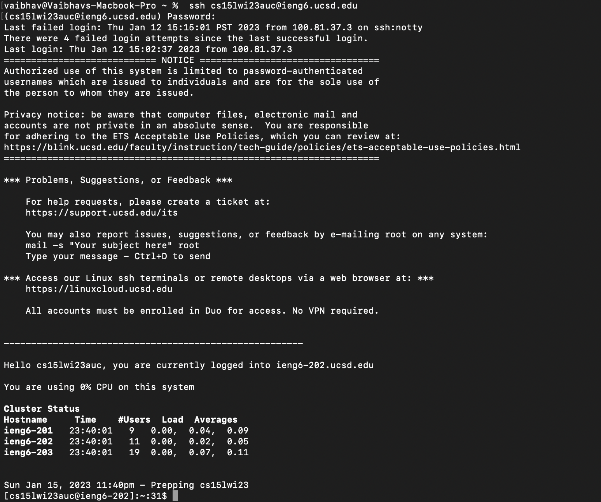

# Week 1 Lab report
This blog will help you log into a course-specific account on `ieng6`
## Step 1: Installing VScode
Go to the [VScode website](https://code.visualstudio.com/). Download the version for macOS.
This is what a VScode window should look like.

## Step 2: Connecting remotely
Open a new terminal from VScode's menu bar. Type `ssh cs15lsp23zz@ieng6.ucsd.edu` on the terminal window where the `zz` is your course specific account. 
This is what you should see:

```
The authenticity of host "ieng6.ucsd.edu (128.54.70.227)' can't be establis
RSA key fingerprint is SHA256:ksruYwhnYH+sySHHAtLUHngrPEZTD1/1x99wUQcec.
Are you sure you want to continue connecting (yes/no/[fingerprint])?
```
type yes, and now you have logged in. This is what the terminal window should look like:


## Step 3: Trying some codes
Some codes you can try on the terminal is 
* `cd ~`
* `cd`
*  `ls <directory>`
*  `cat /home/linux/ieng6/cs15lwi23/public/hello.txt`

The last example wherin `cat` is used. This prints the content of the file. This is how it should look on the terminal:


