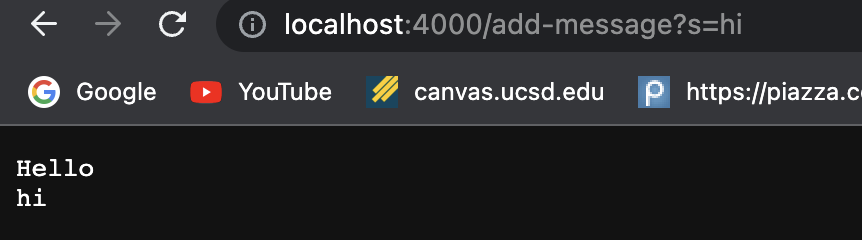

# Week 2 Lab report
---
## Part 1: Creating a Server
The servers objective is to keep track of single string that gets added to by incoming requests.
The code for the server is as follows:
```
import java.io.IOException;
import java.net.URI;
import org.xml.sax.ErrorHandler;
import org.xml.sax.ErrorHandler;

class Handler implements URLHandler {

StringBuilder str = new StringBuilder();

    public String handleRequest(URI url) {
        if (url.getPath().contains("/add-message")) {
            
            str.append(url.getQuery().substring(2)+"\n");
            return str.toString();
        }
         else {
            System.out.println("Path: " + url.getPath());
            return "404 Not Found!";
        }
    }
}
class StringServer {
    public static void main(String[] args) throws IOException {
        if(args.length == 0){
            System.out.println("Missing port number! Try any number between 1024 to 49151");
            return;
        }
        int port = Integer.parseInt(args[0]);

        Server.start(port, new Handler());
    }
}
```
When run, this code generates a web server like this:


First, the main method in `StringServer` class is called. Which makes a `Handler` object. For this, the `Handler` class implements the `handleRequest` method which processes the path and query to give results on the screen of a website. In this, the string after `/add-message?s=`is appended to an instance variable str. str is a StringBuilder that appends the passed string in a new line every time the web page is loaded.  If the url doenst have a `/add-message?s=` in it, it is an unfound web page and the server returns a 404 not found error. This is because, the argument isnt relevant to the `handleRequest` method. If the argument is relevant, str instance variable is printed.

This is how it looks if the webpage is loaded twice with different string values after the `/add-message?s=`:



## Part 2: Bugs from lab 3
One of the bugs I found in Lab 3 was while testing the `reverseInPlace()` method of the class `ArrayExamples`. Here the Array wasnt being deep-copied into a placeholder before changing looping and reversing.


An input with repetitions of the same element didn't induce a failure:


However, when different elements where in the array, the test failed:


This bug was because there is no placeholder. After adding a placeholder that deepcopied the argument array, and using that to "reverse in place", the test ran.

the change in the code was:


The JUnit passed with this code:


## Part 3: Learnings from Lab 2 and Lab 3
In the last two lab classes, I learnt how to create a web server and connect it to my website. I learnt how to handle and process urls especially using different queries. I also learnt how to use Junit effectively and find bugs.
